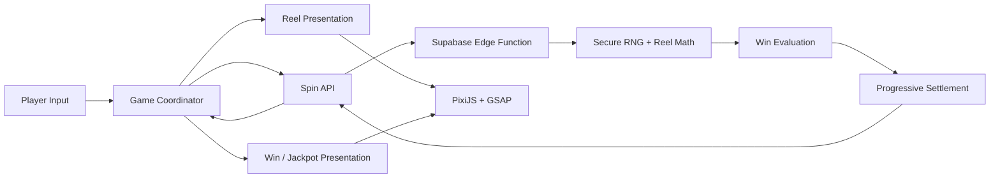

# QUEST OF FORTUNE

**A browser-based 5×4 slot game built with TypeScript, PixiJS, GSAP, Vite, and Supabase.**

[**▶ PLAY DEMO**](https://jeps0n.github.io/quest-of-fortune/) **·** [**View Source**](https://github.com/jeps0n/quest-of-fortune)

QUEST OF FORTUNE pairs a fantasy-adventure slot presentation with production-style engineering underneath: ordered reel math, server-authoritative outcomes, shared progressive jackpots, responsive PixiJS presentation, and dedicated tools for validating the math behind the game.

The goal is simple: keep the fortune on the reels and the authority in the right place.

## Highlights

- **5×4 reel game with 16 fixed paylines** driven by ordered, circular production reel strips.
- **Server-authoritative production spins** through a Supabase Edge Function; the browser presents successful results rather than generating or reinterpreting them.
- **Four jackpot tiers** — MINI, MINOR, MAJOR, and GRAND — with shared progressive state for MAJOR and GRAND.
- **Atomic progressive settlement** designed around contribution-before-payout/reset semantics.
- **PixiJS rendering + GSAP presentation** for reel motion, symbol wins, character sequences, jackpot effects, HUD transitions, and startup presentation.
- **Responsive fixed-stage scaling** that preserves cabinet/reel geometry across viewport sizes.
- **Developer presentation controls** that can select legal outcomes from the real reel strips without painting or replacing symbols.
- **Dedicated math tooling** for simulation, exact reel-derived RTP analysis, reel generation/optimization, and structural reel auditing.

## Architecture



The runtime is intentionally split by responsibility:

- `src/game/` owns game coordination, state, reel results, paylines, paytable data, and win evaluation.
- `src/data/` defines the browser's backend boundary for authoritative spins and shared jackpot state.
- `supabase/functions/` owns production outcome generation and progressive settlement orchestration.
- `src/pixi/` owns rendering, reel sequencing, controls, paylines/paytable views, jackpots, and win presentation.
- `src/presentation/` coordinates higher-level presentation sequences and HUD transitions.
- `src/dev/` contains developer-facing controlled-outcome tooling used to exercise presentation paths.
- `src/tools/` contains offline math, reel-generation, optimization, and audit utilities.

## Production Spin Flow

A normal spin crosses one authority boundary:

1. The client requests a spin without supplying outcome parameters.
2. The Supabase Edge Function generates secure random reel stops against the production reel strips.
3. The server evaluates paylines and jackpot conditions.
4. Progressive state is settled on the backend.
5. The client receives the landed result, evaluated awards, and authoritative progressive-meter snapshot.
6. The browser animates that result and reconciles its displayed jackpot meters to server state.

This keeps production outcome authority outside the browser while allowing the presentation layer to remain responsive and independently structured.

## Game Math

Quest of Fortune uses five ordered circular reel strips with **201 stops per reel**. Strip order is treated as math: changing adjacency changes the set and frequency of visible 5×4 windows even when symbol counts remain unchanged.

The game uses **16 fixed paylines**. Standard symbols pay for left-to-right 3-, 4-, or 5-of-a-kind line wins according to the paytable. Character symbols also participate in the jackpot system when five or more matching character symbols appear anywhere in the 5×4 result.

The production math is validated through both **exact reel-derived analysis** and a deterministic **5,000,000-spin Monte Carlo simulation**. The exact analysis calculates return and jackpot frequencies directly from the production reel strips, while simulation independently exercises the same math over a large sample.

| Metric | Exact | 5M Simulation |
| --- | ---: | ---: |
| Reset / Base RTP | **93.5999%** | **93.6827%** |
| Funded RTP | **95.5999%** | **95.6827%** |
| Hit frequency | — | **29.7251%** |
| MINI frequency | 1 in 399 | 1 in 399 |
| MINOR frequency | 1 in 999 | 1 in 996 |
| MAJOR frequency | 1 in 1,999 | 1 in 1,991 |
| GRAND frequency | 1 in 9,999 | 1 in 9,960 |

The funded RTP includes a separately funded **2.0% progressive contribution**. The close agreement between the exact reel-derived results and the seeded simulation provides an independent validation of the production math configuration.

## Progressive Jackpots

MINI and MINOR are fixed awards. MAJOR and GRAND are shared progressive meters.

Each $1 production wager contributes **2% total** to the progressive system, split evenly between MAJOR and GRAND. Settlement follows a deliberate ordering rule:

**contribution → evaluate/award current progressive value → reset an awarded progressive → return authoritative meter state**

That means a winning spin's own contribution is included in the progressive value it can award. Progressive mutation is handled behind the server boundary rather than trusted to the browser.

## Developer & Math Tooling

The repository includes tooling beyond the playable client:

- **Math simulator** — seeded large-sample simulation plus exact reel-derived RTP and jackpot-frequency reporting.
- **Reel target profiling** — searches reel compositions against RTP and jackpot-frequency targets.
- **Reel sequence optimizer** — generates deterministic candidate strip orderings while enforcing symbol-distribution and local-window constraints.
- **Reel audit** — validates composition, circular spacing, clustering, adjacency, viewport density, and other structural properties of a candidate reel set.
- **Controlled presentation selection** — developer-only controls locate legitimate stops on the production reel strips so specific payline or anywhere outcomes can be exercised without painting symbols into the viewport.

These tools are intentionally separate from production spin authority. They exist to tune, validate, audit, and exercise the game rather than alter the production outcome pipeline.

### Developer Outcome Controls *(Select & Test Specific Outcomes)*

Press **Ctrl + Alt + Shift + ↓** to toggle the developer controls. Choose a symbol, count, and **PAYLINE** or **ANYWHERE** mode, then select **ARM NEXT SPIN**. The next spin uses legal stop positions from the real production reel strips to exercise the selected presentation outcome; the controls do not paint or replace symbols in the viewport.

## Run Locally

### Prerequisites

- Node.js with npm
- A configured Supabase project for production spin requests and shared jackpot state

### Environment

Create a local `.env` file:

```env
VITE_SUPABASE_URL=your_supabase_project_url
VITE_SUPABASE_PUBLISHABLE_KEY=your_supabase_publishable_key
```

Only the publishable browser credential belongs in the client environment. Privileged jackpot mutation remains server-side.

### Install and run

```bash
npm install
npm run dev
```

Create a production build with:

```bash
npm run build
```

Preview the built client locally with:

```bash
npm run preview
```

## Math & Reel Commands

```bash
# Production reel math validation
npm run math:prod

# Faster production validation run
npm run math:prod:quick

# Validate candidate reel input
npm run math:cand
npm run math:cand:quick

# Generate / optimize candidate reel sequences
npm run reels:generate

# Audit candidate reel structure
npm run reels:audit
```

## Project Structure

```text
src/
├── audio/          Audio lifecycle and playback
├── config/         Cabinet / stage layout constants
├── data/           Client data-access and server API boundary
├── dev/            Developer presentation controls
├── game/           Runtime coordination, state, and game math
├── lib/            Shared service configuration
├── pixi/           Rendering, reels, controls, jackpots, and win FX
├── presentation/   Cross-system presentation sequencing
├── tools/          Math simulation and reel engineering tools
└── ui/             Responsive stage scaling

supabase/
└── functions/      Server-authoritative spin pipeline
```

## Tech Stack

| Layer | Technology |
| --- | --- |
| Language | TypeScript 6 |
| Rendering | PixiJS 8 |
| Animation | GSAP 3 |
| Build tooling | Vite 8 |
| Backend / shared state | Supabase |
| Styling | HTML5 + CSS3 |

## Design Goals

Quest of Fortune was built as a focused engineering portfolio project. The primary goals were to demonstrate:

- clear separation between **outcome authority and presentation**;
- slot math implemented as explicit, inspectable data and algorithms;
- modular rendering and animation rather than a monolithic game class;
- progressive-state handling with well-defined settlement semantics;
- tooling that can validate reel behavior instead of relying only on visual playtesting; and
- a finished game presentation built with web-native game technologies.

---

*QUEST OF FORTUNE is a personal game-development portfolio project built to demonstrate the systems and engineering behind a complete browser slot game.*

**QUEST OF FORTUNE** — *May fortune favor the next spin.*
